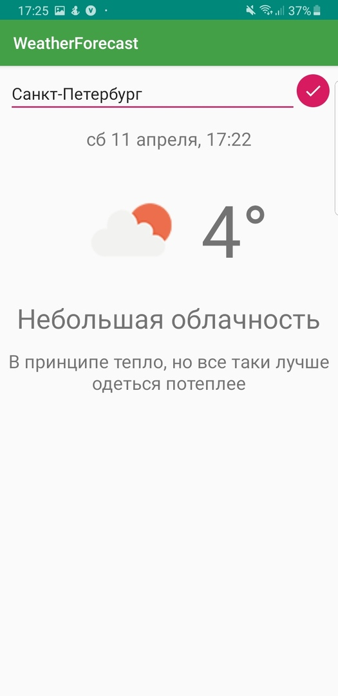
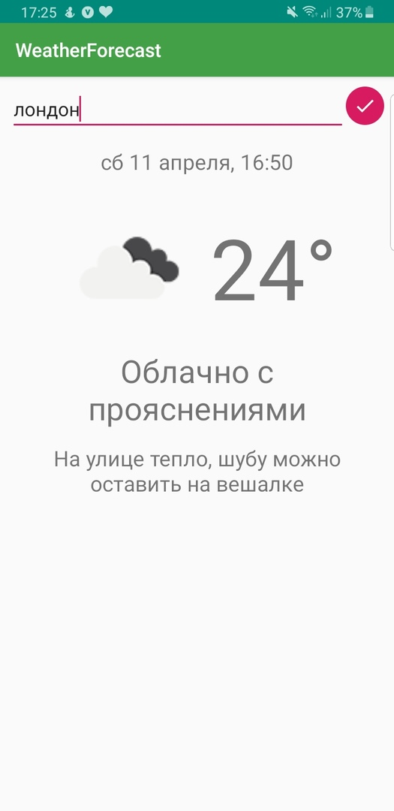

<h1> Weather-forecast </h1>

 Сервис по  прогнозу погоды 

 Уровень сложности: средний уровень сложности с задачаой со звездочкой. 

<h2> Проектирование сервиса </h2>

 Для решения задачи был выбран язык программирования Java, использовалась среда разработки Android studio 

 Пользовательский интерфейс - мобильное приложение

 На выходе пользователь получает картинку с погодой, а также температура в градусах, "состояние неба" и совет как нужно одеться

 <b> Пример для Санкт-Петербурга: </b> 

 <b> Пример для Лондона: </b>

<h2> Видео будет доступно в папке video </h2>
<h2> Процесс работы программы по шагам: </h2>

 1. Пользователь вводит в EditText свой город (в будующем можно будет сделать и по координатам, метод для того, чтобы связаться с API есть, но не до конца разобрался с location в андроиде, а костыли писать не хочется, поэтому это будет доступно в будующем) 

 2. Приложение создает запрос на сервер. Кроме города, на сервер отправляются данные о языке пользователя. 

 3. Приложение отправляет запрос на сервер, затем получает ответ в форме JSON. 

 4. Приложение обрабатывает полученный JSON и заносит данные в класс Weather.

 5. Данные выводятся пользователю на экран. 

<h2> Как запустить программу </h2>
<h3> Первый способ, если есть среда разработки Android studio</h3>

 1. Клонировать гит репозиторий к себе на компьютер  

 2. Дождаться, когда Gradle все соберет  

 3. Запустить на девайсе или эмуляторе

<h3> Второй способ</h3>

 1. Клонировать гит репозиторий к себе на компьютер  

 2. Из папки app скопировать на телефон и затем его установить  

